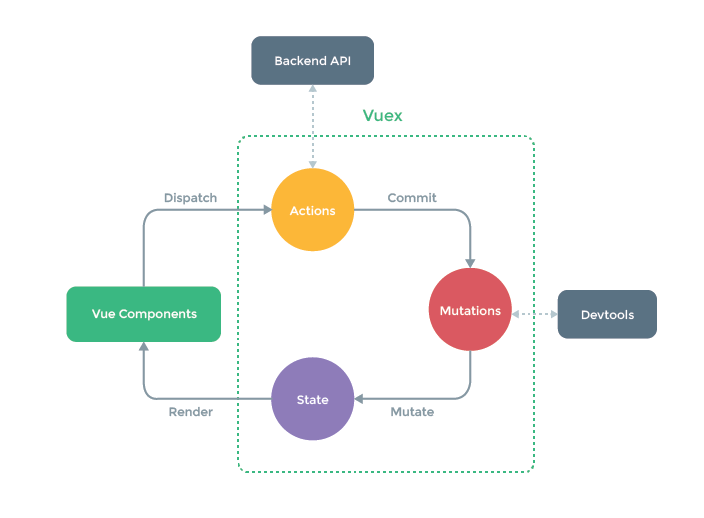

#### Vuex
##### 一、简介
Vuex是一个专为Vue.js应用程序开发的状态管理模式。它采用集中式存储管理应用的所有组件的状态，并以相应的规则保证状态以一种可预测的方式发生变化。

##### 二、核心概念
每一个 Vuex 应用的核心就是store（仓库）。“store”基本上就是一个容器，它包含着你的应用中大部分的状态 (state)。Vuex 和单纯的全局对象有以下两点不同：

1. Vuex的状态存储是响应式的。当 Vue组件从store中读取状态的时候，若store中的状态发生变化，那么相应的组件也会相应地得到高效更新。
2. 你不能直接改变store中的状态。改变store中的状态的唯一途径就是显式地提交(commit)mutation。这样使得我们可以方便地跟踪每一个状态的变化，从而让我们能够实现一些工具帮助我们更好地了解我们的应用。


这张图里，绿色虚线内就是Vuex的核心，state中保存的是公共状态，改变state的唯一方式就是通过mutation进行改变。

##### 三、为什么要使用Vuex
大家都知道父子组件传值可以使用props或者是用依赖注入的方法。但是如果是同级组件之间要进行组件通讯就很麻烦了，他们必须要共用父组件通过自定义事件进行通讯。

##### 四、在vue中使用vuex
```cmd
npm install vuex --save
```
在main.js文件中:
```cmd
Vue.use(Vuex)
```

##### 五、vuex核心概念学习
###### 1、State
Vuex使用单一状态树,用一个对象就包含了全部的应用层级状态。每个应用将仅仅包含一个 store 实例。单一状态树让我们能够直接地定位任一特定的状态片段，在调试的过程中也能轻易地取得整个当前应用状态的快照。

**备注：state 是存储的公用的属性值**

其他组件获取state里的值：

~~~
computed:{
	propA(){
		return this.$store.state.a
	}
	propB(){
		return this.$store.state.b
	}
}
~~~

或者通过映射：

~~~
computed:{
    ...mapState({
        propA:a
        propB:b
	})
}
~~~

###### 2、Getter

Vuex 允许我们在 store 中定义“getter”（可以认为是 store 的计算属性）。就像计算属性一样，getter 的返回值会根据它的依赖被缓存起来，且只有当它的依赖值发生了改变才会被重新计算。

**备注：Getter对应的对象里面有一些可以用来操作和计算的方法（本身不会改变state)**

其他组件获取Getter里的值：

~~~
this.$store.getters.fullInfo
~~~

或者：

~~~
computed:{
    ...getters({
        fullInfo
	})
}
~~~

###### 3、Mutation
更改 Vuex 的 store 中的状态的唯一方法是提交 mutation。Vuex 中的 mutation 非常类似于事件：每个 mutation 都有一个字符串的 事件类型 (type) 和 一个 回调函数 (handler)。这个回调函数就是我们实际进行状态更改的地方，并且**它会接受 state 作为第一个参数**。

**备注：Mutation对应的对象里面写一些共用的方法，第一个参数是state，从第二个参数开始是调用该方法时传入的参数**

其他组件获取Mutation里的值：

~~~
this.$store.commit('xxx',{a:1,b:2})//传多个值
this.$store.commit('xxx',1)//传单个值
~~~

或者：

~~~
methods:{
    ...mapMutation({
        xxx
	})
}
~~~

###### 4、Action

Action 类似于 mutation，不同在于：
- **Action 提交的是 mutation里的方法**，而不是直接变更状态。

  ~~~
  当异步函数体内调用mutation里的同步函数时，this.$store.commit('xxx',a1,a2,...)
  ~~~

- Action 可以包含任意异步h桉树操作。

其他组件获取action里的值：

~~~
this.$store.dispatch('xxx',{a:1,b:2})//传多个值
this.$store.dispatch('xxx',1)//传单个值
~~~

或者：

~~~
methods:{
    ...mapAction({
        xxx
	})
}
~~~


###### 5、Module
由于使用单一状态树，应用的所有状态会集中到一个比较大的对象。当应用变得非常复杂时，store 对象就有可能变得相当臃肿。

为了解决以上问题，Vuex 允许我们将 store 分割成模块（module）。每个模块拥有自己的 state、mutation、action、getter、甚至是嵌套子模块——从上至下进行同样方式的分割

具体代码：

**home.vue:**

~~~vue
<template>
  <div>
    <h1>home page</h1>
    <div class="content">
      <one></one>
      <two></two>
    </div>
  </div>
</template>
<script>
import One from './One'
import Two from './Two'
export default {
  components: {
    One,
    Two
  },
  data() {
    return {
      
    }
  },
}
</script>
<style>
.content {
  display: flex;
}
</style>
~~~
**one.vue:**

~~~vue
<template>
  <div>
    <h2>one page</h2>
    <!-- <p>{{$store.state.count}}</p> -->
    <!-- <p>{{count}}</p> -->
    <!-- <button @click="count++">+</button> -->
    <ul>
      <li v-for="(item, index) in fruits" :key="index">
        <span>品种：{{item.name}}</span>
        <span>价格：{{item.price}}</span>
      </li>
    </ul>
    <!-- <h4>{{name}}</h4> -->
  </div>
</template>
<script>
import { mapState } from 'vuex' // 如果需要获取多个state,可以使用mapState这个辅助函数

export default {
  data() {
    return {
      // count: this.$store.state.count,
      // fruits: this.$store.state.fruits
    }
  },
  created() {
    console.log(this.$store.state.count)
  },
  computed: {
    ...mapState(['count', 'fruits', 'name'])
  }
}
</script>
<style>
  
</style>
~~~

two.vue

~~~vue
<template>
  <div>
    <h2>two page</h2>
    <!-- <button @click="add">点击增加</button> -->
    <!-- <ul>
      <li v-for="(item, index) in changePrice" :key="index">
        <span>品种：{{item.name}}</span>
        <span>价格：{{item.price}}</span>
      </li>
    </ul>
    <ul>
      <li v-for="(item, index) in changeList" :key="index">
        <span>品种：{{item.name}}</span>
        <span>价格：{{item.price}}</span>
      </li>
    </ul> -->
    <ul>
      <li v-for="(item, index) in fruits" :key="index">
        <span>品种：{{item.name}}</span>
        <span>价格：{{item.price}}</span>
      </li>
    </ul>
    <button @click="newPrice(1)">优惠大降价</button>
    <button @click="newPriceAsync(1)">延迟执行优惠大降价</button>
    <button @click="newPriceAsync">延迟执行优惠大降价</button>
  </div>
</template>
<script>
import { mapState, mapGetters, mapMutations, mapActions } from 'vuex' // 如果需要获取多个state,可以使用mapState这个辅助函数

export default {
  data() {
    return {
      
    }
  },
  methods: {
    // add() {
    //   this.$store.state.count++
    // }
    ...mapMutations(['newPrice']), // 1.使用mapMutations辅助函数
    // 2.提交mutations
    // newPrice(num) {
    //   this.$store.commit('newPrice', num)
    // }
    ...mapActions(['newPriceAsync']), // 1.使用mapActions辅助函数
    // 2、使用dispatch
    newPriceAsync () {
      this.$store.dispatch('newPriceAsync', 2)
    }
  },
  computed: {
    ...mapState(['fruits']),//使用mapState辅助函数
    ...mapGetters(['changePrice', 'changeList'])// 使用mapGetters辅助函数
  }
}
</script>
<style>
  
</style>
~~~

store.js

~~~js
// 1.创建一个store.js文件
import Vue from 'vue'
import Vuex from 'vuex'

Vue.use(Vuex)

export const store = new Vuex.Store({
  state: {
    count: 0,
    name: 'jianan',
    fruits: [
      {name:'苹果', price:10},
      {name:'西瓜', price:11},
      {name:'香蕉', price:12},
      {name:'黄瓜', price:13},
      {name:'榴莲', price:100}
    ]
  },
  getters: {
    changePrice: (state) => {
      return state.fruits.map(item => {
        return {
          name: item.name,
          price: item.price * 2
        }
      })
    },
    changeList: (state) => {
      return state.fruits.map(item => {
        return {
          name: '进口' + item.name,
          price: item.price * 4
        }
      })
    }
  },
  mutations: {
    newPrice: (state, cuihua) => {
      return state.fruits.map(item => {
        item.price -= cuihua
      })
    }
  },
  actions: {
    newPriceAsync: (storeAll, goudan) => {
      setTimeout(()=> {
        storeAll.commit('newPrice', goudan)
      }, 2000)
    }
  }
})

// const moduleA = {
//   state: {},
//   getters: {},
//   mutations: {},
//   actions: {}
// }

// const moduleB = {
//   state: {},
//   getters: {},
//   mutations: {},
//   actions: {}
// }

//  export const store = new Vuex.Store({
//   modules: {
//     one: moduleA,
//     two: moduleB
//   }
// })

// state是所有组件的公共data

// getters是用于对state中派生出一些状态，可以理解为计算属性computed
// getter的返回值也会根据它的依赖被缓存起来，并且只有当它的依赖值发生了改变的时候才会被重新计算

// 更改vuex中state中状态的唯一方法是提交mutations，vuex中mutations类似于事件

// action类似于mutation，不同之处在于
// action是提交mutation,而不是直接改变状态
// action可以包含异步操作。但是mutation是不行的
// action是通过$store.dispath方法去触发的，mutation通过$store.commit方法提交

// 当我们的应用所有的状态集中到一个store中的时候，应用变得比较复杂，为了解决这个问题
// Vuex允许我们将store分割成模块(module),每个模块拥有自己的state、getter、mutation、action

~~~

心得：

1. 在**store.js中有五大vuex的属性**，分别是

   **state**(公共data)，**getters(**公共computed),

   **mutation（**公共methods,唯一改变state的方式）,**action**(公共可带有async函数的methods，它提交的是moutation，而不是直接改变状态),**modules**(分割store.js)

2. 在one.vue，two.vue,three.vue...中可以**通过mapState,mapGetters,mapMutation,MapAction 来获取上述的对应的数据和方法**

3. 其中mapState,mapGetters在computed函数中通过...['对应参数']来引入

   mapMutation,MapAction在methods中来引入即可

4. **知道就行...**

    /*除了 2，3的方式来获取对应的数据和方法以外：

   还可以在data（）里通过 this.$store.state.属性来获取对应的属性和属性值

   在methods中通过this.$store.commit来调用mutation里的方法

   通过this.$store.dipatch来调用action里的方法*/

   

文档：

https://www.jianshu.com/p/2e5973fe1223

在做项目的时候：

​	我们可以把store.js 分成 motutation .js  action.js state.js getter.js，然后整合到index.js再引入 

​	同时我们可以为了防止同事瞎写方法名和事件，可以单独拉一个文件出来，然后通过[obj.a]的方式来影射那个文件的方法名