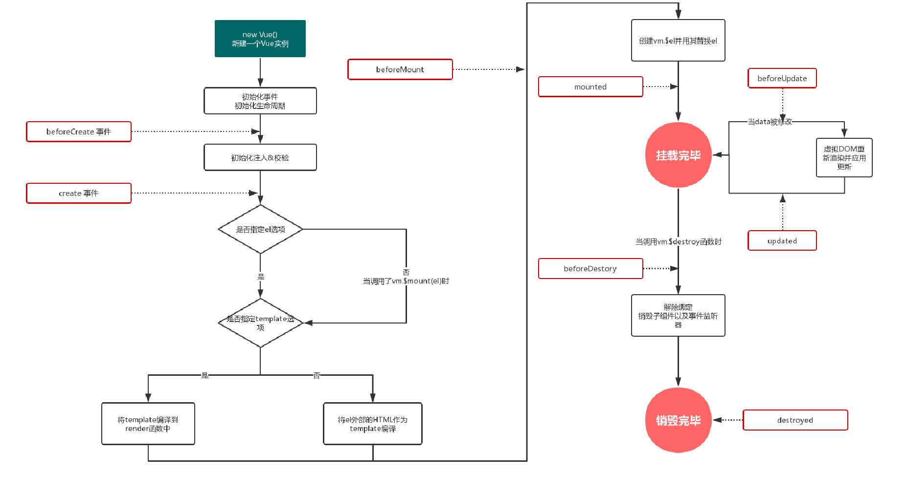

# vue的生命周期

## Vue实例的数据与方法

### vue实例的数据与方法

当一个 Vue 实例被创建时，它将 data 对象中的所有的属性加入到 Vue 的响应式系统中。

当这些属性的值发生改变时，视图将会产生“响应”，即匹配更新为新的值。

**Vue 实例的实例属性与方法。它们都有前缀 $，以便与用户定义的属性区分开来**

栗子：

~~~js
let data = {name:'申杰'，data:'哈哈'}；
let vm = new Vue({
    el:'#example',
    data:data
})
vm.$el === document.getElementById("example")//true
vm.$data.data===vm.data;//true
~~~

在上述代码中：、

~~~js
vm.$watch('data',function(newVal,oldVal){
    console.log('新值：'+newVal);
    console.log('旧值'+oldVal);
})
~~~

打印出：

~~~js
//vm.$data.data='哈哈尼玛'
//新值：哈哈尼玛
//旧值哈哈
~~~

### Vue的实例属性之data

### 属性: vm.$data; 数据类型: data

Vue 将会递归将 data 的属性**转换为 getter/setter，**从而让 data 的属性能够响应数据变化。

**注：也就是只有有getter和setter的方法才可以响应数据变化**

1. 对象必须是纯粹的对象(含有零个或多个的 key/value 对)

2. **推荐在创建实例之前，就声明所有的根级响应式属性。**

3. 实例创建之后，可以通过 vm.$data 访问原始数据对象。Vue 实例也代理了 data 对象上所有的属性，因此**访问 vm.a 等价于访问 vm.$data.a。**

4. 如果data里面的属性值本身就有$和_命名开头的，那么就必须使用vm.$data.$$property的方式进行访问

5. 子组件定义data的方式是这样的：

   ~~~
   data(){
   	return{
   		name:'申杰'，
   		age:'27'
   	}
   }
   ~~~

   因为组件可能被用来创建多个实例。而data是一个对象，是引用型，所有实例指向同一个地址的同一个值，一改全改，这是一个解决方案

### Vue的实例属性之props

属性: vm.$props; 数据类型: data

**props 可以是数组或对象，用于接收来自父组件的数据**。

1. props 可以是简单的数组，

2. 或者使用对象作为替代，对象允许配置高级选项，（可以用来检测）

props对象的语法可以使用以下选项：

1. type:

   string、Number、Boolean、Array、Object、Date、Function、Symbol

   (若不是会 抛出警告)

2. default: 任何数据   （默认值）

   (若不是会 抛出警告)

3. required: Boolean;（是否 必填）

   (若不是会 抛出警告)

4. validator:  Function;（自定义验证函数）

   (若不是会 抛出警告)

### Vue的实例属性之el

属性: vm.$el; 数据类型: Element

提供一个在页面上已存在的 DOM 元素作为 Vue 实例的挂载目标。**可以是 CSS 选择器，也可以是一个 HTMLElement 实例。**

在实例挂载之后，元素可以用 vm.$el 访问。

如果在实例化时存在这个选项，实例将立即进入编译过程，

**否则，需要显式调用 vm.$mount() 手动开启编译。**

例子：（**在项目中可用于延时挂载**）

~~~html

~~~

js部分:

~~~js
let data = {name:'申杰',data:'哈哈'};
let vm = new Vue({
    data:data,
    template:`<h1>Hello World {{name}}{{data}}</h1>`
})
~~~

此时页面并不会加载 模板里面的内容:

此时:

~~~js
vm.$mount("#animated-number-demo");
~~~

将会加载

总结:vm.$mount("#animated-number-demo")

和el:"#animated-number-demo"

实际上是一样的,只不过**可以延时加载**

### Vue的实例属性之options

**属性: vm.$options; 数据类型: Object**

**用于当前 Vue 实例的初始化选项。**

需要在选项中包含**自定义属性**时会有用处：(一般没啥用,

vue自带的就基本Ok了)

~~~js
let vm = new Vue({
		el:'#animated-number-demo',
		data:{
			name:'申杰',
			age:'26'
		},
		opt1:'大帅哥' //此处时自定义属性
	})
~~~

自定义属性可以通过:vm.$options.opt1来得到其对应的值

也就代表着 **vm.$options会显示我们写的自定义属性**

### Vue的实例属性之组件逻辑关系

**属性: vm.$parent; 数据类型: Vue instance;**

父实例，如果当前实例有的话

**属性: vm.$root; 数据类型: Vue instance;**

当前组件树的根 Vue 实例。如果当前实例没有父实例，此实例将会是其自己。

**属性: vm.$children; 数据类型:Arry<Vue instance>**

当前实例的直接子组件。需要注意 $children 并不保证顺序，也不是响应式的。如果你发现自己正在尝试使用 $children 来进行数据绑定，考虑使用一个数组配合 v-for 来生成子组件，并且使用 Array 作为真正的来源。

### Vue的实例方法之watch

vm.$watch( expOrFn, callback, [options] )

**回调函数得到的参数为新值和旧值**。

​	1. 这里的表达式只能写一个函数名,具体的写在方法里面去才行

注:

​	2. **在变异 (不是替换) 对象或数组时，旧值将与新值相同**，

​	3. 因为它们的引用指向同一个对象/数组。Vue 不会保留变异之前值的副本。

4. vm.$watch 返回一个取消观察函数，用来停止触发回调：

~~~
let w = vm.$watch('prop',callback,[options]);//这里的w是一个返回的取消函数名
~~~

#### [options]

1. deep

   为了发现对象内部值的变化，可以在选项参数中指定 deep: true 注意监听数组的变动不需要这么做。

2. immediate

   在选项参数中指定 immediate: true 

   将立即以表达式的当前值触发回调：

   简单来说, **在Vue实例加载的一瞬间就执行一次回调函数**
   
   **也就是说 保证上去 就可以执行一次这个回调函数**
   
   注:
   
   在带有 immediate 选项时，你不**能在第一次回调时取消侦听给定的 property。**
   
   如果我就想取消,那么可以加个判断
   
   也就是不能这样:
   
   ~~~js
   let w = vm.$watch('name',function(newVal,oldVal){
   		console.log('dosomething');
   		w();
   	},{
   		deep:true,
   		immediate:true
   	})
   ~~~
   
   可以这样:
   
   ~~~js
   let w = vm.$watch('name',function(newVal,oldVal){
           console.log('dosomething');
           if(w){
               w(); 
           }
   	
   	},{
   		deep:true,
   		immediate:true
   	})
   ~~~

### Vue的实例方法之set/delete

**vm.$set( target, propertyName/index, value )**

向响应式对象中添加一个属性，并**确保这个新属性同样是响应式的，且触发视图更新**。它必须用于向响应式对象上添加新属性，因为 Vue 无法探测普通的新增属性 (比如 this.myObject.newProperty = 'hi')

**vm.$delete( target, propertyName/index )**

删除对象的属性。如果对象是响应式的，**确保删除能触发更新视图。**这个方法主要用于避开 Vue 不能检测到属性被删除的限制

### Vue的实例方法之on监听自定义事件

###### vm.$on( eventName, callback )

监听当前实例上的自定义事件。事件可以由vm.$emit触发(在示例内部方法中可以用this.$emit)。回调函数会接收所有传入事件触发函数的额外参数。

~~~js
let vm = new Vue({
    data:{
        name:{
            a:'申杰',
            b:'哈哈'
        }
    }
})
vm.$on('sayName',function(name){
    console.log(name+'超级无敌帅');
})
vm.$watch('name',function(){
    this.$emit('sayName',this.name.a)
},{
    deep:true,
    immediate:true
})
~~~

###### vm.$once( eventName, callback )

监听一个自定义事件，但是只触发一次，

在第一次触发之后移除监听器。

vm.$off( [eventName, [callback]] )

移除自定义事件监听器。

* 如果没有提供参数，则移除所有的事件监听器；
* 如果只提供了事件，则移除该事件所有的监听器；
* 如果同时提供了事件与回调，则只移除这个回调的监听器。

~~~js
let vm = new Vue({
    data:{
        name:{
            a:'申杰',
            b:'哈哈'
        }
    }
})
vm.$on('sayName',function(name){
    console.log(name+'超级无敌帅');
})
vm.$watch('name',function(){
    this.$emit('sayName',this.name.a)
},{
    deep:true,
    immediate:true
})
vm.$off('sayName');//之后再改变name属性就不会被监听了
~~~

## 生命周期的基本概念

每个 Vue 实例在被创建时都要经过一系列的初始化过程
例如，需要设置数据监听、编译模板、将实例挂载到 DOM 并在数据变化时更新 DOM 等。

同时**在这个过程中也会运行一些叫做生命周期钩子的函数，**

这**给了用户在不同阶段添加自己的代码的机会。**

比如 created 钩子可以用来在一个实例被创建之后执行代码：

**注:不要在选项属性或回调上使用箭头函数，因为箭头函数的this指向的是定义函数时所在的环境, 而不是实例本身**

| 生命周期钩子  | 组件状态                                                     | 最佳实践                                                     |
| ------------- | ------------------------------------------------------------ | ------------------------------------------------------------ |
| beforeCreate  | 实例初始化之后，t**his指向创建的实例**，**不能访问到**data、computed、watch、methods**上的方法和数据** | 常用于初始化非响应式变量                                     |
| created       | 实例创建完成，**可访问**data、computed、watch、methods上的方法和数据，未挂载到DOM，**不能访问到$el属性，$ref属性内容为空数组** | 常用于简单的ajax请求，页面的初始化, 注意此时的元素并未显示在网页上, 所以一旦ajax请求过多, 那么就会出现长时间的白屏现象 |
| beforeMount   | 在挂载开始之前被调用，beforeMount之前，会**找到对应的template**，并**编译成render函数**(appendChild,appendChild,appendChild) | –                                                            |
| mounted       | **实例挂载到DOM上**，此时可以通过DOM API获取到DOM节点，$ref属性可以访问 | 常用于获取VNode信息和操作，ajax请求, 此时元素已经显示在网页上, 可以发起一些大量数据的请求(**此时可以开始进行数据的显示**) |
| beforeupdate  | 响应式数据更新时调用，发生在虚拟DOM打补丁之前s               | 适合在**更新之前访问现有的DOM**，比如手动移除已添加的事件监听器 |
| updated       | 虚拟 DOM 重新渲染和打补丁之后调用，组件DOM已经更新，可执行依赖于DOM的操作 | **避免**在这个钩子函数中操作数据，可能**陷入死循环**         |
| beforeDestroy | 实例销毁之前调用。**这一步，实例仍然完全可用，**this仍能获取到实例 | 常用于**销毁定时器**、解绑全局事件、销毁插件对象等操作       |
| destroyed     | 实例销毁后调用，调用后，Vue 实例指示的所有东西都会解绑定，所有的事件监听器会被移除，所有的子实例也会被销毁destroyed | –                                                            |

### 生命周期的钩子函数

1. 初始化组件时，仅执行了beforeCreate/Created/beforeMount/mounted四个钩子函数
2. 当改变data中定义的变量（响应式变量）时，会执行beforeUpdate/updated钩子函数
3. 当切换组件（当前组件未缓存）时，会执行新组件的beforeCreate/Created/beforeMount, 然后执行当前组件的beforeDestory/destroyed钩子函数,最后再执行新组建的mounted
4. **初始化和销毁时的生命钩子函数均只会执行一次，**beforeUpdate/updated可多次执行

测试代码:

~~~html

<!DOCTYPE html>
<html>
	<head>
		<meta charset="utf-8">
		<title>生命周期</title>
		
	</head>
	<body>
		

			<button type="button" v-on:click="changeCom">切换组件</button>
			<component v-bind:is="currentCom"></component>
		

		
	</body>
</html>

~~~

